# U1 概述

## 计网定义：

计算机**互连**在一起，然后它们之间就可以**共享资源**了。

## 网络、互连网、互联网：

网络是最小的，互连网将不同的网络给连接起来，而互联网是全世界最大的互连网。

## 互联网的发展阶段：

第一：APARNET到 Internet

第二：**三级结构**（主干网、地区网、校园网）的Internet

第三：**多层次ISP结构**的Internet

## 互联网的组成：

- 边缘部分
  - 由连接在互联网上的主机构成。AKA资源子网。
- 核心部分
  - 由大量的网络和路由器构成，AKA通信子网。

## 实现数据交换的方式：

电路交换

报文交换

分组交换

## 祖国接入互联网的日子：

1994.4.20

## 计网的分类：

- 按范围
  - WAN
  - LAN
  - MAN
  - PAN
- 按使用者
  - 公用网
  - 专用网

## 性能指标

### 速率

基本单位：bit per secend

常用单位：

kbps，Mbps，Gbps，Tbps	步长为$10^3$

### 带宽

最高速率

### 吞吐量 X

### 时延

#### 发送时延

待发送数据的长度/发送速率

#### 传输时延

发送方和接收方的物理距离/传播速率

（不清楚那常见的3种材质的传播媒介的传播速率要不要记忆，临考前记一下吧）

#### 排队、处理时延 X

### 时延带宽积

定义就是时延和带宽的乘积，由于最终结果的单位剩余的是bit，所以其物理意义是链路所能容纳的bit数量。

### 往返时间RTT

数据从发送开始，再到收到接收方确认的这段时间

### 信道利用率

信道利用率并不是越高越好，太高了反而会导致堵塞。和生活中车多路堵一个道理。

## 计网分层的相关概念：

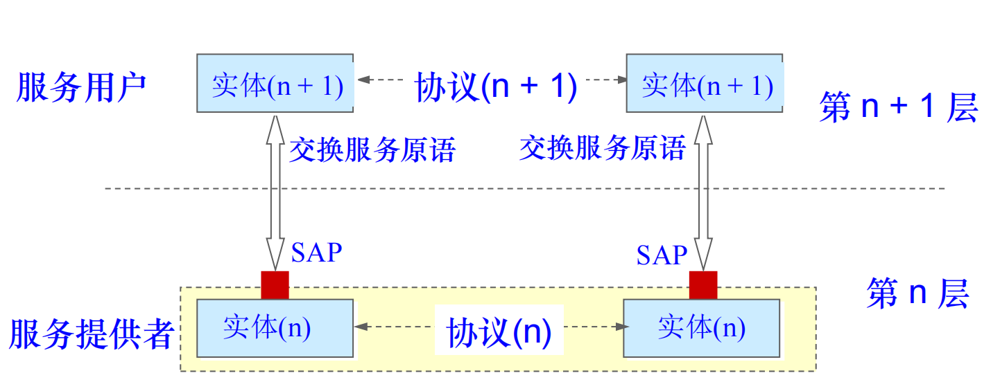

服务是垂直的，协议是水平的。

## 计网的体系结构：

### 开放系统互连参考模型（OSI/RM）

虽然是**法律上的国际标准**，但是并没有被市场认可。

- 应用层
- 表示层
- 会话层
- 运输层
- 网络层
- 数据链路层
- 物理层

### TCP/IP模型

市场认可的，**事实上的国际标准**。

- 应用层
- 运输层
- 网际层
- 网络接口层

### 原理模型（我们学习的层次）

- 应用层
- 运输层
- 网络层
- 数据链路层
- 物理层

数据在这些层次流动的过程：**往下层层封装，网上层层解封。**

# U2 物理层

## 物理层接口特性

- 机械特性
- 电气特性
- 功能特性
- 过程特性

## 基带调制、带通调制

输入源都是数字基带信号，经过基带调制后仍然是数字基带信号，经过带通调制后是模拟信号。

## 常见编码方式

- 曼彻斯特编码
  - 看码元中间时刻电平的跳变方向，默认上0下1，若没有答案，那就反转。
- 差分曼彻斯特编码
  - 看码元开始时刻是否发生电平跳变，规定：无跳变表示1，有跳变表示0。

## 奈氏准则

码元的传输速率 = 2 x W（频率带宽）

能够调制出来的码元数目越多，那么用于给它们编号的二进制位数越多，那么一个码元所能携带的二进制信息也就越多。

## 香农公式

C = W x log2(1+S/N)

C是bps的极限值。

S/N，信噪比，是一个整体，但是题目一般比较喜欢说 X db，那我们要自己去换算S/N后才能够去算C。

X = 10 x log10(S/N)

等价变换一下就有一个更好用的公式：

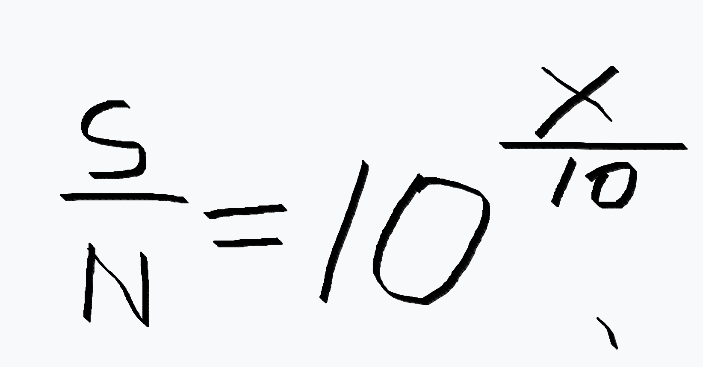

## 常见信道复用技术

- FDM
- TDM
- WDM
- CDM

### CDM

码片序列

每一个站点都有自己唯一的码片序列，**不同站点的码片序列是彼此正交**（规内 = 0）的。

站点发送数据时，如果想发1，那么就发自己的码片序列；如果想发0，那么就发自己码片序列的反码。

假设C站点想接收A站点发的数据，那么C站点只需要将收到的码片序列（混合成一坨的混合物）和发送方A的码片序列做规格化内积就能知道A发送了哪些数据。

- 1->1
- 0->不是自己的
- -1->0

# U3 数据链路层

## 三个重要问题

- 封装成帧⭐
- 透明传输⭐
- 差错检测⭐

## 封装成帧

将一段数据添加上个帧首部、尾部之后，便成为了一个帧。

注意：数据部分的大小是有上限的，也成为MTU（最大传输单元）。在以太网中，**MTU被规定为1500B**。

## 透明传输

核心问题就是如何解决数据部分的比特流中，出现了和帧首尾部一样的比特序列。

解决办法：

转义字符：传输之前在在数据部分进行转义，到达目的地后再将转移字符干掉。

0比特填充：在数据部分中，每出现**5个连续的1**，就在其后添加一个0。

## 差错检测

如何知道自己接收到的帧有没有发生误码？

考点：CRC循环冗余校验。

收发双方约定好一个**生成多项式**；

**发送方：**

计算冗余码，然后将冗余码拼接到待发送数据后面发送出去。

key：计算冗余码——二进制除法

构造被除数：给待发送数据后面添加生成多项式最高次数个0。

构造除数：写出生成多项式对应的二进制序列。

开始除：其实就是逐比特异或。

取最终的余数。

冗余码的位数要和生成多项式最高次数一样，若不够就通过在余数的高位补0来补齐。

最后得到的就是冗余码，然后将其拼接到待发送数据后面发送出去。

**接收方：**

被除数就是接收到的数据

除数就是生成多项式对应的二进制序列。

然后直接开始除。

看余数是否为0就能知道收到的这段数据有无错误。为0表示没有出现误码，反之就是出现了误码。

## MAC地址

由48 bit组成

对接口的标识，唯一的。

## CSMA/CD协议

在**共享总线的以太网**中，不允许多个发送方同时往总线上发送数据！也就是说，这个协议是为了半双工通信而生的。

### MA（多址接入）

总线允许连接多个站点。

### CS（载波监听）

站点在即将发送数据之前，要通过载波监听来判断站点是否空闲，如果空闲了，就发送自己的数据。

### CD（碰撞检测）

站点发送数据过程中，还要继续检测碰撞信号。如果检测到碰撞信号，就立即停止发送，并且回避一段时间后再从载波监听开始。

### 问题

#### 一个站点最晚要多久才能收到碰撞信号？

假设A，B两个站点位于信道的两端，信号的单程传播时延为t。

 假设A先发数据，当A发的信号刚好到达B的家门口的时候，B的信号迎头赶上来，然后二者就撞车了。随后碰撞型号原路返回，经过t后被A检测到。也就是说，发送方**最晚要经过2t才会收到碰撞信号**。这个2t也称为争用期。碰撞只可能发生在争用期内。

试想，如果站点自发送数据开始，直到2t时都没有检测到碰撞信号，那么就说明这个信道已经彻底被自己独占了。

**10Mbps的共享总线以太网规定了争用期为51.2微秒。**还可以导出这期间一共可以发出64字节的数据。再结合前面的分析，如果接收方收到的数据小于64字节，那么就可以断定发送方遭遇了碰撞，所以直接把这个帧丢掉就好。这64字节AKA**最小帧长**。

#### 发生碰撞了后的退避时间如何确定？

发生碰撞后，至少要等待**以争用期为倍数**的时间。具体多少倍是由以下公式决定的：

k = **min (重传次数，10)**

然后从 [0, $2^{k-1}$]内选择一个随机数r。

最终要退避的时间就是 **r x 争用期**。

注意：如果**重传次数达到16次**，则说明当前信道过于繁忙。所以就不再发送数据，并且向高层报告错误。

## 使用交换机和集线器来拓展以太网的范围

### 集线器

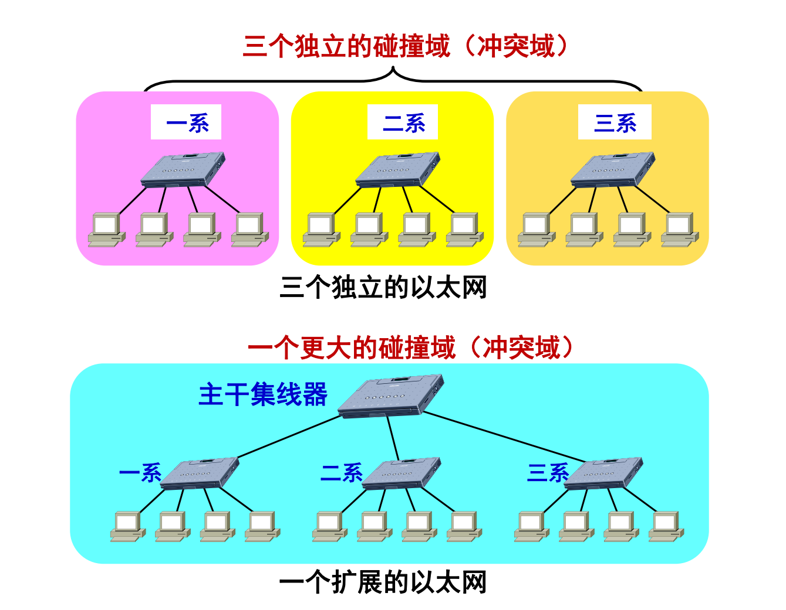

### 交换机

可以看出使用交换机来拓展以太网可以有效地避免碰撞，因为人家把碰撞域隔离开了。

补充：两个都是合成一个更大的广播域。

### 对带宽的影响

集线器将带宽**平均分**给每一台主机，而交换机可以让每个用户**独占**带宽。

## 交换机

### 转发表是如何建立起来的（自学习算法）

交换机的每一个端口都和一个主机的网口相连。交换机的转发表记录的是自己的**端口与其所连主机网口的MAC地址的对应关系。**

当交换机从某个端口收到一个帧时，会先查看有没有源MAC地址和这个端口的映射关系记录，如果没有，则先登记。

然后看有没有目的MAC地址到某个端口的记录。如果没有，则从其余端口“**盲目转发**“这个帧。如果有，就从相应端口“**精确转发**”出去。

### 交换机互连的时候存在的问题，以及解决方案

产生环路，**STP**（生成树协议）

# U4 网络层

## 重要功能

- 分组转发
- 路由选择

## 网络层对上层提供的两种服务

- 面向连接的**虚电路**服务
  - 可靠通信由**网络自身**来保证。所以是可靠的服务。

- 面向无连接的**数据报**服务
  - 可靠通信由**用户主机**来保证。所以是不可靠的服务。

然而，**Internet的网络层采用的是数据报服务**！

## IP协议

网际层使用的协议之间的关系如下图所示：

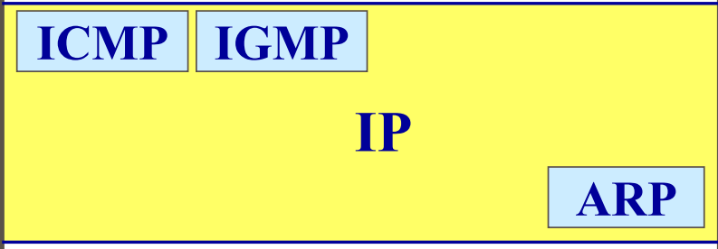

## IP地址

用于唯一标识**网络上**的各主机（准确来说应该是主机的**各个接口**）。

IP地址由**32bit**组成，一般采用**点分十进制**来表示IP地址（每8位为一组，然后分别写出它们的十进制表示，用点隔开）

用于分配给主机的IP地址由以下两部分组成：**网络号 + 主机号**

**同一个局域网下的主机所获得的IP地址的网络号必须相同，但主机号不同。**

**集线器、交换机的接口是不需要IP地址的**，现阶段我们只需知道**只有路由器和主机的接口需要分配IP地址**。

## IP地址的编址方法

### 分类的IP地址

A、B、C类IP地址。

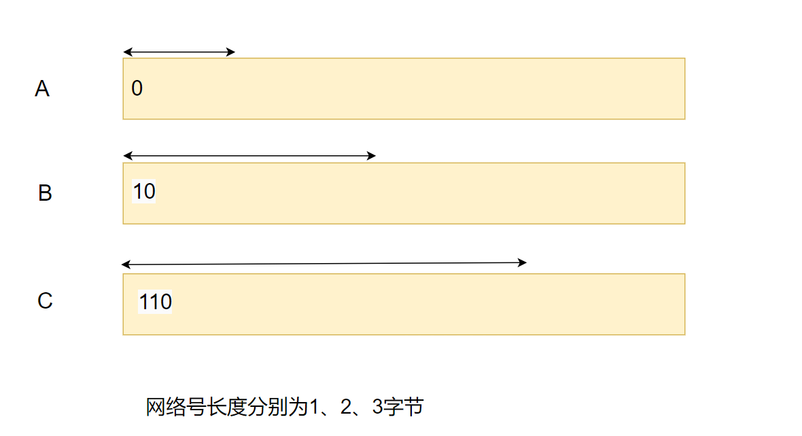

其实**只看第一个字节最前面几位的固定部分就能区分出这3类啦**。

接下来介绍由第一个字节对应的十进制快速判断A、B、C类地址的小技巧：

对于A类地址而言，第一个字节的最高位固定为0，那么最小就是后7位全0，最大就是后7位全1。换算成十进制就是**0~127**。在这个范围内的就是A类地址。不过A类中有两个特殊的网络号不能用于分配，即**1和127**，它们有各自的特殊用途（网络号就A特殊）。

按照同样的分析方法，我就直接给出一个数轴吧。

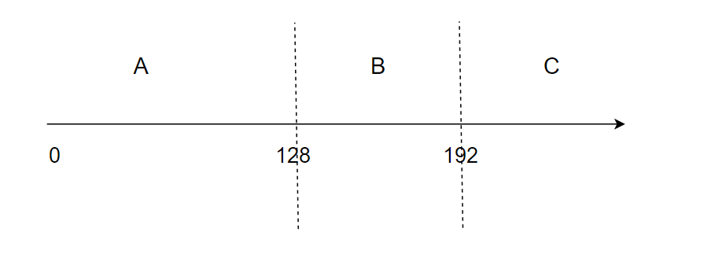

主机号中也有两个特殊的数不能分配：全0和全1。其中全0表示的是网络的IP地址，而全1表示的是当前网络内部的广播地址。

#### 特殊的IP地址

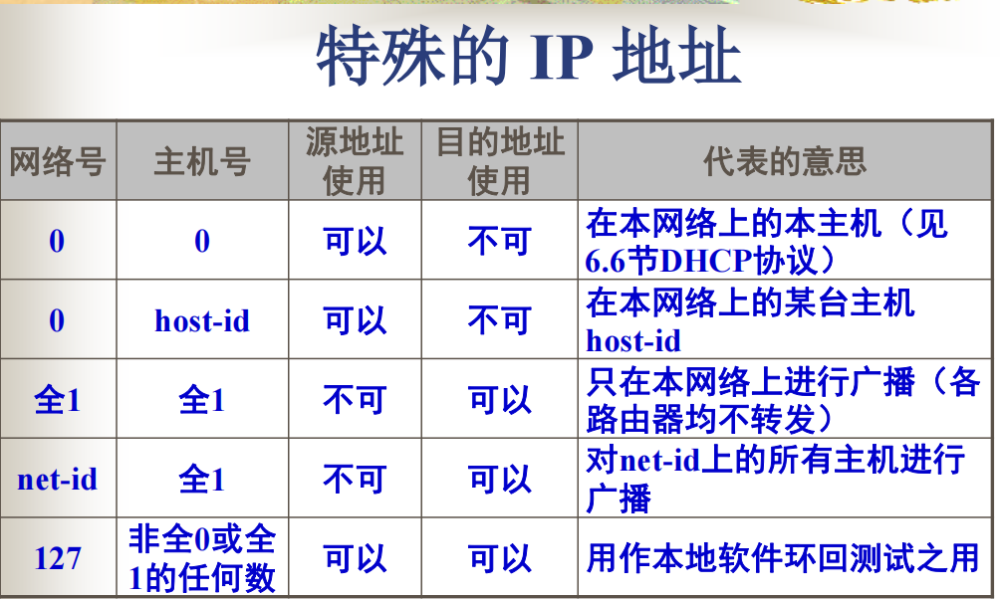

总结：

**网络号全0但主机号不全1**的只能作源地址。

**只要主机号全1**，就只能作目的地址。

127开头的，但主机号不是特殊主机号的，只表示自己的计算机，它两个都要！

### 划分子网

在基于分类IP地址的情况下，**从主机号里面借一些bit作为子网号**，这样的话IP地址就成了三级结构：

网络号 + 子网号 + 主机号。但是总的来说，相当于拓展了网络号。

划分子网是一个单位内部的事情，外界是不知道这个单位划分了子网的。

为了能够得出每一个子网的IP地址，我们需要**子网掩码**作为辅助。我们**用子网掩码和IP地址做按位与操作后就能得到子网的IP地址。**

**子网掩码和其对应的子网的IP地址是存储在路由表中的**，当外界的IP数据报传到这个路由器时，路由器会做以下操作：

**拿这个IP数据报的目的IP地址逐个与路由表每一行的子网掩码进行AND操作，然后拿结果和当前子网掩码对应的子网IP地址进行比较，如果相等，那么路由器就知道该转发给这个子网。否则，就继续这个过程，直到路由表遍历完毕**，这就是所谓**划分子网时路由器转发分组的算法**

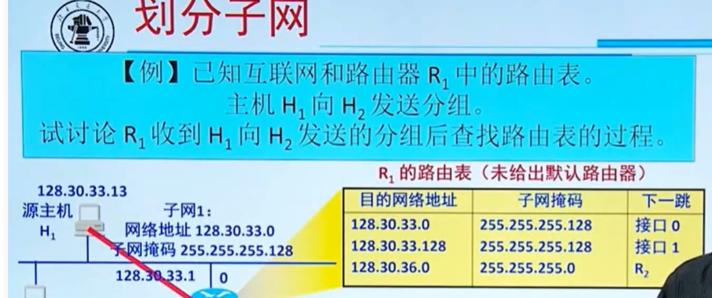

### CIDR无分类编址

IP地址由网络前缀和主机号构成。一般IP地址后面会有这样的标识：/数字N

这表示IP地址的前N位作为网络前缀，后续的32-N位就是主机号了。

我们把**具有相同网络前缀的IP地址们**称为CIDR地址块。一个CIDR地址块里面包含的IP地址数目确实多。

我们可以把原来路由表里的多条路由信息合并成一个CIDR，这样也称为**构造超网**。具体操作流程就是**找这些IP地址的前面有多少位是连续相同的，然后这些相同的部分就作为网络前缀，这样它们就合并到一个CIDR地址快里面了**。

那如何路由该匹配呢？

采用**最长前缀匹配**的方法：

这个D能和路由表中的这两条记录匹配上，这是CIDR的特点。但是我们**要选择网络前缀最长那个**。推荐先给路由表排个序（降序），然后逐个比。最先匹配上那个就是目的网络。

## ARP地址解析协议

IP地址解决了在网络层唯一标识网络上各主机的问题。但是网络层的数据终归还是要交给数据链路层进行传送的，所以我们还会继续用到MAC地址。

先以一个网络内的主机间通信为例，A要给B发数据。但是A只知道B的IP地址，但是并不知道B的MAC地址。如果不把这缺失的内容补上，将无法正常传递数据。

我们**如何由B的IP地址获取到B的MAC地址呢**？这就是ARP地址解析协议要干的事情了！

ARP协议解决的是**同一网络内**的主机或路由器的**IP地址和MAC地址的映射问题**，不能跨网络使用。

这个协议工作的过程：

继续A给B发数据的例子。

首先，同一网络内的各主机和路由器会各有一张自己的**ARP缓存表**。上面登记了近期和自己来往过的主机的IP和MAC的映射关系。能在缓存里面查到的就没必要走流程了。

如果没有，那就麻烦了，ARP启动！

A在当前网络内发送一条**广播帧（ARP请求报文）**，这个广播的内容包含A自己的信息（IP + MAC地址）以及寻人启事（拿着B的IP去询问B的MAC是什么）。

当前网络内的所有主机都会收到这个广播。如果发现里面的目的IP地址不是自己的，那么就丢弃。

最后主机B发现这是问自己的。于是立马给A发送一条**单播帧（ARP响应报文）**，并且在自己的ARP缓存表中登记A的相关信息。

当A收到ARP响应报文后，先将B的信息缓存起来，然后就能把缺失的部分给填上，随后A和B就可以愉快地交♂流了。

## IP数据报的目的地

如果收件人和发件人处于**同一个网络内**，那么直接发给对方就好。

反之，就先将IP数据报转发给自己的**默认网关（网络出口路由器）**，由这个路由器帮忙将IP数据报**转发**出去。然后经过不断接力，最终将IP数据报送达目的网络。

## IP数据报格式

框起来的字段是要求重点掌握的：

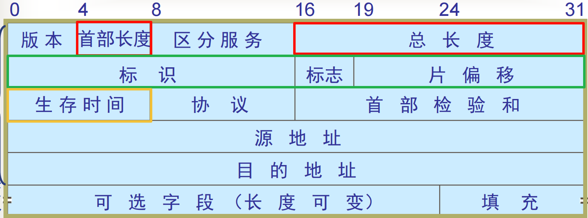

首部长度：**以4B为单位**，共4bit，标识了当前IP数据报首部的长度，从[5,15]之间取值。

总长度：**以1B为单位**，共16 bit,标识了当前IP数据报的总长度，最大为65535。

### IP数据报分片

由于数据链路层规定了帧的数据部分的最大长度（**MTU一般为1500B**，要记），所以当IP数据报的总长度超过了MTU时，就要对IP数据报进行拆分。

具体拆法就是**将IP数据报的数据部分拆成合适大小，然后给每一个片加上首部。**在绿色框中填写相关信息，以方便接收方还原出被拆分的IP数据报。

**标识**字段是原IP数据报的ID，当其被拆分之后，其分片的首部的标识字段就是从原IP数据报那里继承下来的。

**标志**里面有两个重要字段：MF（更多分片），DF（不允许分片）

如果某个分片不是最后一个分片，那么MF就为1，表示其后头还有分片。

DF为1时表示不允许分片，但是一般都是允许分片的，所以一般就为0。

**片偏移**字段表示当前片相对于原IP数据报数据部分的偏移量。其取值**以8B为单位**，其值等于**当前分片数据部分的第一个字节的序号 / 8**。

注意分片的时候，分片的大小不是乱取的，而是要保证每一个分片的数据载荷部分的第一个字节的序号必须能被8整除。

我总结了一个公式：

已知数据链路层规定的MTU = X，那么**每个IP分片的数据载荷的最大值**应该为：

### TTL（生存时间）

IP数据报的寿命以跳数为单位。

IP数据报**每到达一个路由器**，路由器**先将TTL字段的值减一，如果值<= 0，那么直接丢弃这个IP数据报，否则就转发出去。**

## ICMP协议

为了有效转发IP数据报和提高交付的成功率。

ICMP是网际层协议，其比IP位置高。

ICMP按功能可分为两种：差错报告、询问

我感觉差错报告可能会考吧，所以差错报告有：

- 终点不可达
- 超时
- 参数错误
- 重定向

典型应用：

**ping** 测试和目的ip的连通性：

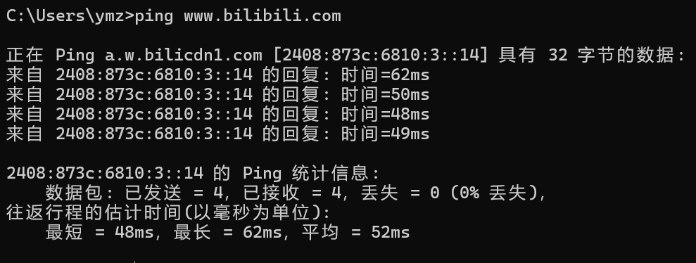

**tracert **查看到达目的地址要经过哪些路由，也就是**追踪一路上要经过哪些路由**：

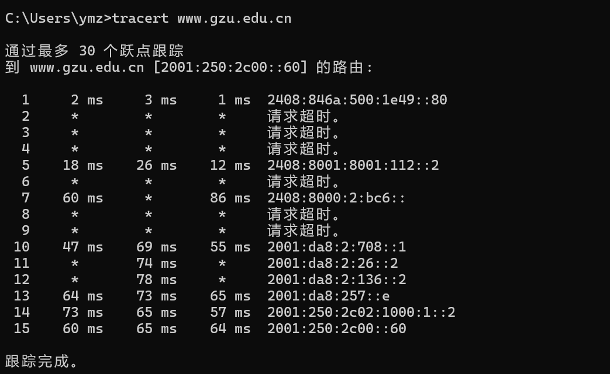

## 路由选择协议

基本概念：

AS（自治系统）：一个自治系统内部的所有路由都采用同一路由选择协议，并且协商好什么是好的路由。

路由选择协议分为：IGP（内部网关协议），EGP（外部网关协议）。

我感觉重点应该是AS内部的IGP。

### RIP（路由信息协议）

基本概念：基于距离向量的。

距离：一个路由到其直连的网络距离为1，到非直连的网络的距离为一路上所经过的路由器数目 + 1。

**距离为16的网络被认为是不可达的**，所以RIP只能适用于**小型互联网**。

RIP认为好的网络就是**距离最短的网络**。

#### 距离向量算法：

路由器A收到相邻路由器B发过来的路由器表TB。

路由器A先对其进行相应处理：

- RIP距离统统 + 1（假设A经过B到达B所知道的网络）
- 吓一跳全改为B

然后逐条来和A自己的TA进行比对，具体有以下情况：

- 新网络直接加入
- 相同的下一跳直接更新
- 不同的下一条，留下RIP距离最小的那一个。
- 不同的下一跳如果RIP距离相同，那么可以加入到TA中来，以备负载均衡。

### OSPF（开放的最短路径优先）

选择到目的地代价最小的那一条路。

### 总结

链路上的数字表示代价。当主机A给主机B发消息时，使用不同的IGP时，分别会选择哪条路径？

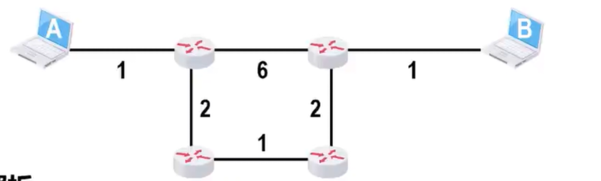

对于RIP而言，它会选择经过路由数目最短的路径，所以走的是这条路：

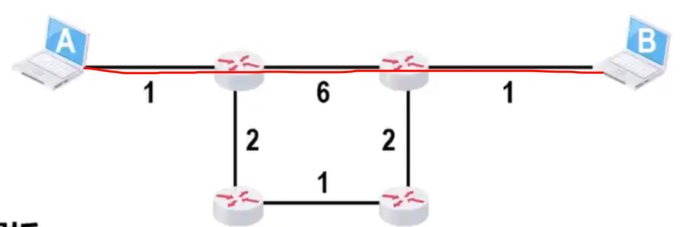

对于OSPF而言，它会选择代价最小的路径，所以走的是这条路：

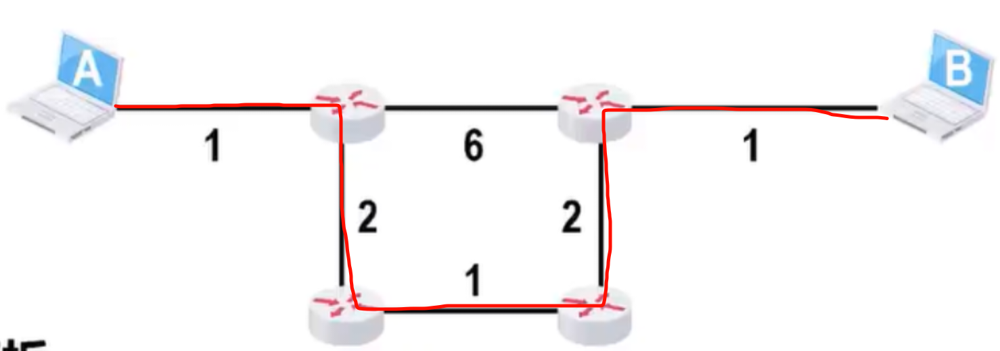

## IPv6

IP地址由**128 bit**组成。

表示方法为：**冒号十六进制**

每两个字节为一组，组内写成十六进制。

零压缩：

把一连串连续的0压缩为一对冒号（::）

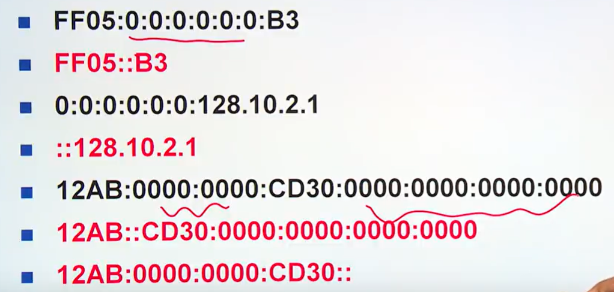

注意：**零压缩只能用一次！**因为你用多次鬼知道你原来的地址长啥样。。。

4向6过度的策略：

- **双协议栈**：让一部分主机同时支持4和6
- **隧道技术**：当IPv6数据报进入IPv4网络时，先将其包装成IPv4数据报，然后就可以在IPv4网络中传输了。当离开IPv4网络后，再将IPv6数据报拆出来。

# U5 运输层

通过前面4层，我们已经实现了**计算机之间的通信。**

但实际上，**真正在通信的是在计算机上运行的进程**。

**当一个数据报到达某台计算机之后，应该将其交付给哪个应用进程呢？**这就是运输层要解决的主要问题了。

## 运输层提供的两种协议

- TCP
  - **面向连接的，可靠的**。像电子邮件这类的应用，必须保证邮件准确无误地被对方接收。它们对可靠性的要求非常高。
- UDP
  - **无连接的，不可靠的。**因为其不需要保证可靠传输，所以限制没有TCP这么多，传输起来也非常**快**。其最适合的场合就是像视频通话这类的应用，因为这类应用要保证**实时性**，即使数据丢失造成了小小的卡顿也没什么大不了的。

## 端口号

运输层使用端口号来**标识本地计算机的每一个需要进行网络通信的应用进程。**

端口号由**16 bit**构成。

端口号的分类如下：

- 服务器端使用的
  - 熟知端口号
  - 登记端口号
- 客户端使用的
  - 客户端应用进程需要进行通信时，会为其**临时分配**一个未被占用的端口号。通信结束后会被收回。所以这是**动态的**。

## UDP

特点：无连接、尽最大努力交付、**面向报文**的（上层交给它的是什么样子，UDP直接原样转交给下层）

首部：UDP的首部仅仅只有8B。注意一下里面的校验和吧，它是对整个UDP报文的校验。而且计算时会临时加上一个伪首部，计算结束后，伪首部就会被删掉。也就是说：**伪首部的意义仅仅是为了计算校验和。**

## TCP

特点：面向连接的、可靠的、**一对一**的、**面向字节流**的（其将上层发送过来的数据当作字节流）

首部：

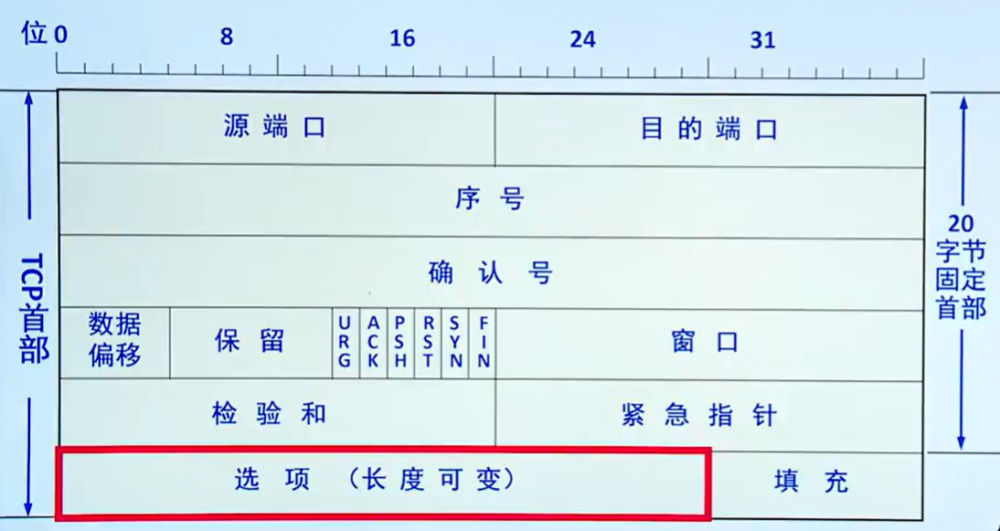

我认为比较重要的字段：

- **序号seq**：当前TCP报文段数据部分的第一个字节的序号。
- **确认号ack**：给接收方用的，用来告诉对方我期待你下一个发送过来的数据的序号是多少。于此同时也由累计确认的含义。即如果ack = N，除了是告诉对方你下一个TCP报文段的seq应该为N外，也包含了我已经正确接收到你原先发过的N - 1 以前的所有字节。
- **数据偏移**：就是首部长度，和IP数据报的首部长度类似，以4B为单位，最小5（20B的固定），最大15。
- **ACK**：必须和ack配套使用。只有ACK = 1了，ack字段才会生效。
- **SYN**：请求建立连接时会用到。
- **FIN**：自己没有数据要发送了，希望断开连接时会用到。
- **窗口**：流量控制会用到，是接收方告诉发送方自己当前的接收能力。

## 连接管理

### 建立连接

一般是客户端发起，服务端被动响应。

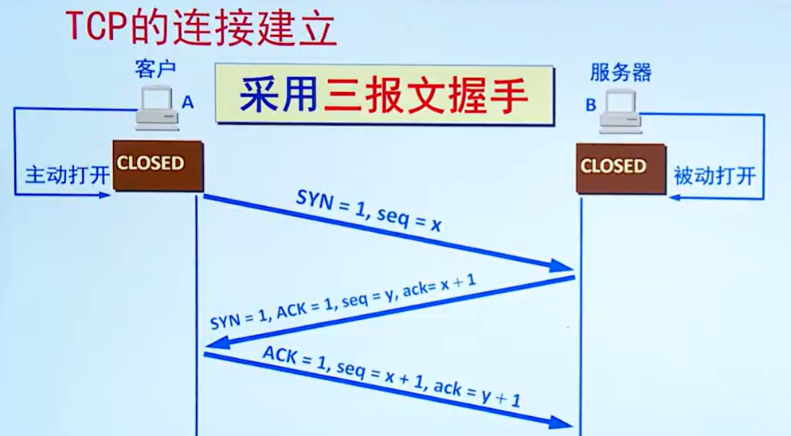

- ①客户端发送连接请求报文段。在连接请求报文段中，SYN=1。消耗一个序号x。
- ②服务端收到①的报文段后，如同意建立连接，则发送同步确认报文段。在这个报文段中，SYN=1，ack = x+1，消耗掉一个序号y。
- ③客户端只需要发起一个普通的确认报文段即可。

注意：SYN=1的报文段不能携带数据，但是会消耗掉一个序号。

在普通TCP报文段中，如果没有数据，则不消耗序号。

### 释放连接

任何一方释放连接都可以，这里就假设是客户端发起的。

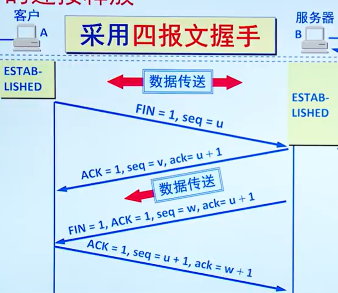

①客户端主动发起FIN报文，通知服务端自己要断开连接了。在这个报文中，FIN = 1。这个报文中可以携带数据，但是如果不携带数据的话，也会消耗掉一个序号。

②服务端收到①后，使用普通的TCP报文段确认。如果还有没发送完的数据的话，就继续发送。

③服务端也发送一个FIN报文，通知客户端可以断开连接。

④客户端使用普通的TCP报文段确认，服务端收到后连接就正式断开了。

但是客户端并不会在确认后立马断开连接，它还要等一段时间（2MSL，最大报文段寿命）。

- 确保④能够到达服务端。
- 经过这段时间后，可以保证原先的TCP连接的TCP报文从网络中消失。

## 可靠传输

实际的信道是不可靠的，运输层的TCP协议要**在不可靠的信道上实现可靠传输**，必然要引入非常多的机制。

### 停止等待协议（Stop and Wait）

发送方发出一个分组后，就要停下来等待接收方的确认分组。收到后再发送下一个分组，如此往复。当然，这是理想情况下的。

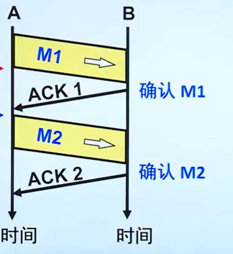

但是如果发送方所发送的分组出现了误码或者丢失的情况下，接收方就不会发送确认分组。于是二者就死锁了。为了打破这一僵局，就要在发送方这里引入一个机制——**超时计时器机制**。就是**每发出一个分组之后，必须在指定时间内收到相应的确认分组。超时后，就重发分组。**

但是还不够。请看VCR。如果是接收方的确认分组出问题了，那么必然引起发送方重传。接收方就会收到重复分组。发送方又该如何判断分组的新旧的呢？这时就要再引入一个机制——**编号机制**。发送方对自己要发送的分组进行编号，接收方对确认分组进行编号。这样**收发双方都有能力判断所收到分组的新旧了**。这样就不怕分组重复的问题了。

#### 信道利用率

我们研究的是理想状态下的信道利用率。而且只看一个周期内的。

也就是一个周期内，发送方的发送时延所占用的百分比。

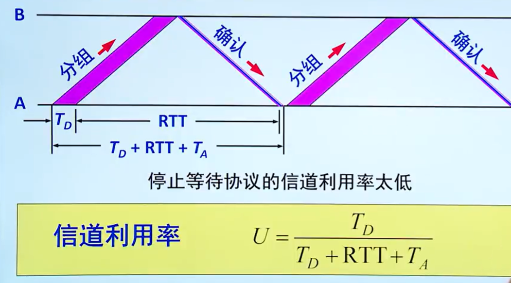

### 连续ARQ协议

出现了窗口的概念。

发送方有发送窗口WT，接收方有接收窗口WR。

发送方**只能发送落入发送窗口内的序号**，**接收方只能接收落入接收窗口内的序号**。

发送方收到确认后，就将发送窗口前移。

假如用n bit来分组进行编号。

#### 回退N帧协议

规定WR = 1 ,  1 < WT <= $2^{n-1}$

#### 选择重传协议

规定：

WT <= $2^{n-1}$

WT<=WR<=$2^{n-1}$

## 流量控制

变量说明：swnd(发送窗口大小)，rwnd(接收窗口大小)

**发送方要考虑接收方的接收能力来发送数据。**

这里是接收方在确认的时候告诉发送方自己目前的接收窗口大小（rwnd）是多少，然后发送方就适当调整自己的发送窗口。

如果rwnd = 0了，swnd也会变为0，表示不能再发送数据了。

如果接收方的rwnd有空闲了，就立马通知发送方。为了避免前面这个报文段丢失，也要求发送方定时发送一个询问报文（**零窗口探测报文段**）。接收方收到这个报文段后，即使自己的rwnd为0，也要处理这个报文段（也就是说，这个零窗口探测报文段是**加急的**），然后立马给发送方回复。

## 拥塞控制

如果当前网络状况非常差，发送方发送再多数据也是徒劳的，因为大概率会丢失，并且也会让网络负担变大。

所以**发送方也会根据当前的网络状况来自己调整自己的swnd。**

其实有两个因素共同决定着swnd，那就是流量控制 + 拥塞控制。

在拥塞控制中会涉及这些变量：cwnd(拥塞窗口大小)，ssthresh(慢开始上限)

**swnd = min(cwnd, rwnd)。**

拥塞控制的一些策略：

慢开始、拥塞避免、快重传、快恢复。

为了更好地说明拥塞控制，我们假设接收方的接收能力是无限大的。这样swnd就取决于cwnd。

### 慢开始：

cwnd从1开始，也就是发送方先发送一个单位的数据。这其实也是在试探网络状况怎么样。

**如果如期收到接收方的确认，那么cwnd将翻倍**。然后如此循环。

在这一阶段，如果发送方如期收到了接收方的确认，那么发送方就会认为当前网络状况不错，于是每一轮都将发送窗口的大小翻一倍（是cwnd起的作用啦）。

但是也不能一直翻倍下去。因为发的数据越多，可能会让增加网络的负担。

**当cwnd == ssthresh的时候，发送方就要变老实了。随后将进入拥塞避免阶段。**

(补充：若ssthresh不是2的次幂该怎么办？	若cwnd *=2 的结果超过了sstresh，那么令cwnd = sstresh，然后开始执行拥塞避免算法)

### 拥塞避免：

在这个阶段，**每成功发送一轮，cwnd只能线性增长（每次 + 1）**。可以看出，发送方为避免网络拥塞，只能妥协，不再有之前每轮翻倍的勇气。

如果过程中翻车了怎么办？比如发送方**发生了超时重传**。

**发生超时重传的时候，也就意味着网络状况开始变糟糕了**，发送方必须有所做为。

这时的策略就是，ssthresh = 当前cwnd的一半，cwnd = 1，从慢开始阶段重新执行。

### 快重传和快恢复：

另外一种情况，网络并不堵塞，只不过部分分组在传输过程中丢失了。比如发送方发出了6个分组（序号分别为1~6），其中3号分组在传输过程中丢失了。接收方正确收到其他分组。只不过从4号分组开始，发送方只能确认按序到达的最后一个分组，也就是继续确认2号分组（ack = 3）。4后面的分组亦是如此。

在确认分组不出意外的情况下，发送方会连续收到3个ack=3的确认分组（假设这时3号分组的重传计时器没有归零）。当收到第3个重复分组的时候，规定了发送方立即重传3号分组（**快重传**），随后进行**快恢复**。

快恢复的策略就是：**ssthresh 和 cwnd 都会被赋值成当前cwnd值的一半**，然后从拥塞避免开始执行。

总结：连续收到3个重复确认立刻进行快重传，然后执行快恢复。

