# 重点一：六大原则

(1) 单一职责

一个对象应该只包含**单一的职责**，并且该职责被完整地封装在一个类中。

(2) 开放-封闭原则

**对拓展开放，对修改封闭。**

(3) 依赖倒置原则

针对接口编程，依赖于抽象而不依赖于具体。

(4) 里氏替换原则

所有引用基类（父类）的地方必须能**透明地使用其子类的对象。**

(5) 迪米特法制

一个实体应当尽量少地与其他实体之间发生相互作用，使得系统功能模块相对独立。

(6) 合成/聚合复用原则

尽量使用合成/聚合的方式，而不是使用继承。


# 重点二：会考编程题的设计模式

## 单例 12.29

核心：如何保证**一个类的对象永远只有一个**？

做法：创建该类对象的权力要交还给这个类自己。外界需要这个类的对象时，找这个类要就好。

Java中实现单例的做法：

- 这个类有一个私有的、静态的引用。其实就是引用本类的对象。**这个类自己给这个引用赋值。**
- 这个类**对外提供一个获取这个引用静态方法。**


这个类可以在这两个地方给这个引用赋值：

- 直接在声明引用时初始化。这种一开始就赋值的做法经常也称为饿汉式（急着赋值）。
- 在获取引用的静态方法中赋值。一开始这个引用的值是null。第一次调用这个静态方法的时候再给它赋值。这种你用到了我才赋值的做法也称为懒汉式（不着急赋值）。


本设计模式的核心就是Java的**static语法**。


OJ例题：

要求定义一个类A，该类A只能被实例化为一个唯一的对象！


你可以用下面的代码来校验o1，o2引用的是不是同一个对象。相关的原理是：引用变量保存的是对象在内存中的地址，如果两个引用变量引用同一个对象，那么二者的值就是相等的，用==判断是否相等就能知道。

```java
public class Main {
    public static void main(String[] args) {
        A o1 = A.getInstance();
        A o2 = A.getInstance();
        if (o1 == o2) {
            System.out.println("o1与o2是同一个对象！");
        }
    }
}
```


参考代码：

```java
//急着赋值的写法
class A{
    private static A a = new A();
    
    public static A getInstance(){
        return a;
    }
    //单例的核心：构造方法牢牢掌握在自己手里
    private A(){
    }
}

//不着急赋值的写法
class A{
    private static A a;
    public static A getInstance(){
        if(a == null) a = new A();
        return a;
    }
    private A(){
    }
}
```


## 模板 12.30

意图：是一种**行为**设计模式，它**在父类中定义了一个操作中的算法的骨架，将一些步骤延迟到子类中实现**。这种模式允许子类在不改变算法结构的情况下重新定义算法的某些步骤。


用一个冲泡饮料例子就能理解此设计模式了：

假设制作一杯热饮需要经过以下步骤：

- boilWater() 烧水
- brew() 冲泡
- pourInCup() 倒入杯中
- addCondiments() 添加调料

其中**哪些步骤的细节是不确定的呢？**比如要制作咖啡或茶，那么冲泡的东西也就不同。每一种饮料所需的配料一般也是不同的，所以添加调料这个步骤也是不确定的。

因此父类将brew() 和addCondiments()变成抽象方法，交由给子类去自定义这两个步骤。

以下是一个简单的例子：

```java
abstract class Drink{

    public void boilWater(){
        System.out.println("烧水咯~");
    }
    //关键点：父类中不明确的步骤就定义成抽象方法，然后交给子类去实现。
    public abstract void brew();
    public void pourInCup(){
        System.out.println("倒进杯子里咯~");
    }
    public abstract void addCondiments();

    //关键点：通用步骤是不允许子类重写的。final在这里的作用是指不允许子类重写这个方法。
    public final void makeDrink(){
        boilWater();
        brew();
        pourInCup();
        addCondiments();
    }
}
class Coffee extends Drink{
    @Override
    public void brew(){
        System.out.println("冲泡速溶咖啡~");
    }
    @Override
    public void addCondiments(){
        System.out.println("加点牛奶~");
    }
}
class Tea extends Drink{

    @Override
    public void brew() {
        System.out.println("冲泡茶叶~");
    }

    @Override
    public void addCondiments() {
        System.out.println("加点蜂蜜~");
    }
}


public class Main {
    public static void main(String[] args) {
        //关键点：这里父类引用可以引用子类对象的行为叫什么？
        //还有：我们将父类引用替换成相应子类的引用时，程序结果会发送变化么？这体现了什么原则？
        Drink coffee = new Coffee();
        Drink tea = new Tea();
        coffee.makeDrink();
        System.out.println("================");
        tea.makeDrink();
    }
}
```

运行结果：

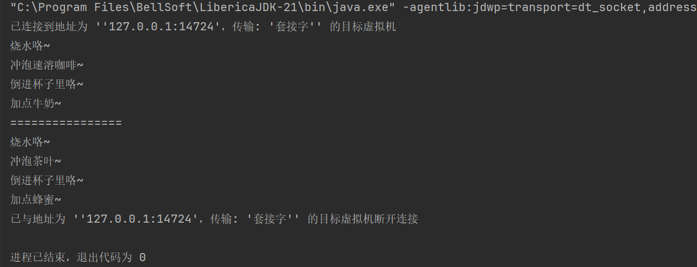


重点：这个设计模式涉及了Java的很多面向对象的语法，比如**抽象类**、**抽象方法**、**多态**、**final修饰方法的作用**。一定要回忆起这些基本的面向对象语法，尤其是多态，这是后续设计模式的基础！


## 策略 12.31

在策略模式定义了一系列算法或策略，并**将每个算法封装在独立的类中**，使得它们可以互相替换。这是行为型模式。

使用这个模式，我们可以**整体替换算法的实现**，**用不同的算法来解决同一个问题。**比如超市有活动时，往往会有不同的收费方案。


核心角色：

- 使用策略的类
- 抽象的策略（只统一了方法的返回值，输入，方法名）
- 具体的策略（负责完善方法体）


OJ例题1：

SalaryManager类管理计时工资，workHourList是历次工作的时长，hourlyRate是小时费率，计算计时工资有两种策略：

- SaryComputerStrategyOne策略，累计工作时长*小时费率，若累计工作时长大于160，再乘以1.2
- SaryComputerStrategyTwo策略，若单项工作时长大于40，则乘以1.2 ,累计后*小时费率

请完成SaryComputerStrategyOne SaryComputerStrategyTwo 两个策略并提交

```java
class SalaryManager{
    private List<Double> workHourList=new ArrayList<Double>();
    private SaryComputerStrategy strage;
    private double hourlyRate;

    public void setHourlyRate(double hourlyRate) {
        this.hourlyRate = hourlyRate;
    }
    public void setStrage(SaryComputerStrategy strage) {
        this.strage = strage;
    }
    public void addWorkHour(double h){
        workHourList.add(h);
    }
    public double computerSalary(){
        return  strage.computerSalary(workHourList,hourlyRate);
    }
}

interface SaryComputerStrategy{
    double computerSalary(List<Double> list,double rate);
}

//完成SaryComputerStrategyOne 和 SaryComputerStrategyTwo 类并提交

public class Main {

    public static void main(String[] args){
        SalaryManager salaryManager=new SalaryManager();
        salaryManager.setHourlyRate(50);
        salaryManager.addWorkHour(52);
        salaryManager.addWorkHour(40.5);
        salaryManager.addWorkHour(38.5);
        salaryManager.addWorkHour(60);
        salaryManager.setStrage(new SaryComputerStrategyOne());
        System.out.println(salaryManager.computerSalary());
        salaryManager.setStrage(new SaryComputerStrategyTwo());
        System.out.println(salaryManager.computerSalary());
    }
}
```

这里会涉及**接口**相关语法，还有**List**集合的使用。千万别背代码喔，尽量理解每一行的含义。


分析：

SalaryManager是策略的使用者。因为其成员位置有一个指向策略接口实现类对象的引用。其的computerSalary方法中就调用了策略对象的具体算法。

这题的本意是让我们填写两种具体的策略类，会涉及到一点点算法的设计。


答案：

```java
class SaryComputerStrategyOne implements SaryComputerStrategy{

    @Override
    public double computerSalary(List<Double> list, double rate) {
        //策略一要求的薪水计算方式：累计工作时长*小时费率，若累计工作时长大于160，再乘以1.2

        //遍历获取总的工作时长
        double sum = 0;
        for(int i = 0; i < list.size();i++){
            sum += list.get(i);
        }
        //基础工资=累计工作时长*小时费率
        double salary = sum * rate;
        //如果累计工作时长大于160，那么就多给一点
        if(sum > 160){
            salary *= 1.2;
        }
        return salary;
    }
}
class SaryComputerStrategyTwo implements SaryComputerStrategy{

    @Override
    public double computerSalary(List<Double> list, double rate) {
        //策略二要求：若单项工作时长大于40，则乘以1.2 ,累计后*小时费率
        //这个老师描述得有点抽象
        double sum = 0;
        for(int i = 0; i < list.size();i++){
            if(list.get(i)>40){
                //若单项工作时长大于40，则乘以1.2是这个意思。
                sum += 1.2 * list.get(i);
            }else{
                sum += list.get(i);
            }
        }
        //累计好后再乘以rate
        return sum * rate;
    }
}
```


OJ例题2：

某软件公司欲开发一款汽车竞速类游戏，需要模拟长轮胎和短轮胎急刹车时在路面上留下的不同痕迹，并考虑后续能模拟更多种轮胎急刹车时的痕迹。现采用策略(Strategy)设计模式来实现该需求，所设计的类图如下所示：

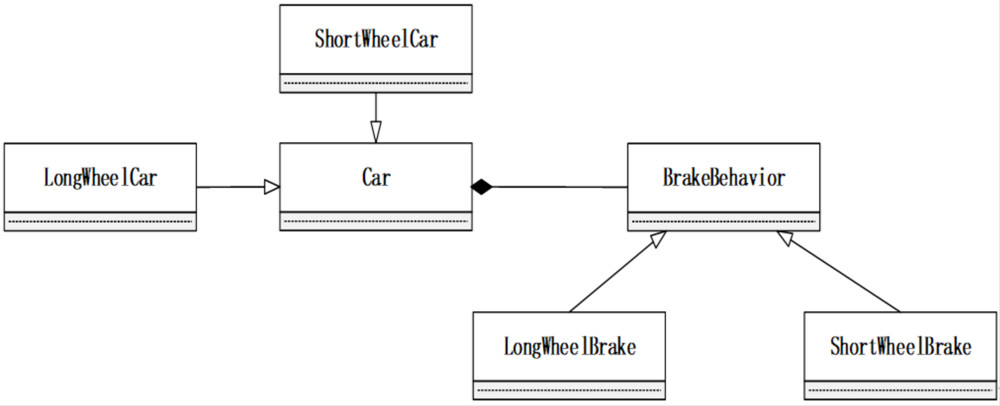

请编码实现模拟长轮胎和短轮胎急刹车时在路面上留下的不同痕迹。完整程序结构如下，本题已经提供了接口BrakeBehavior的定义以及main函数部分，请自行编写并提交红色提示部分代码！

```java
interface BrakeBehavior {
    public abstract void stop();
}
/**

此部分代码需要你编写并提交！

**/
public class Main {
    public static void main(String[] args) {
        BrakeBehavior brake1 = new ShortWheelBrake();
        BrakeBehavior brake2 = new LongWheelBrake();
        Car car = new ShortWheelCar(brake1);
        car.brake();
        car = new LongWheelCar(brake2);
        car.brake();
    }
}
```


参考代码：

```java
class LongWheelBrake implements BrakeBehavior{

    @Override
    public void stop() {
        System.out.println("Simulate long tire brake marks!");
    }
}
class ShortWheelBrake implements BrakeBehavior{

    @Override
    public void stop() {
        System.out.println("Simulate short tire brake marks!");
    }
}
abstract class Car{
    private BrakeBehavior brakeBehavior;
    public Car(BrakeBehavior brakeBehavior){
        this.brakeBehavior = brakeBehavior;
    }
    public void brake(){
        brakeBehavior.stop();
    }
}
class ShortWheelCar extends Car{
    public ShortWheelCar(BrakeBehavior brakeBehavior){
        super(brakeBehavior);
    }
}
class LongWheelCar extends Car{
    public LongWheelCar(BrakeBehavior brakeBehavior){
        super(brakeBehavior);
    }
}
```


## 抽象工厂 1.1

这个模式是创建型模式，即如何创建对象。

在抽象工厂中，会定义创建某种产品的抽象方法。这种抽象方法一般有多个，因为抽象工厂能生产一系列产品。

但是落到实处呢（抽象工厂的子类）？每一个子类生产的产品有自己独一无二的**风格**。

这个我们结合OJ上的题目题目来看就很好理解了：


例题1：

某界面可以使用不同风格的控件：按钮Button有Window风格的子类WindowButton 和Motif风格的子类树MotifButton；

文本框TextBox也有Windows风格文本框WindowsTextBox 和Motif风格的文本框MotifTextBox ，AbstractFactory 是抽象工厂接口，

请实现具体的Window风格工厂WindowFactory 及Motif风格的工厂Motifactory 

```java
package 抽象工厂.题目1;

abstract class Button {
};

abstract class TextBox {
};

class WindowButton extends Button {
    public WindowButton() {
        System.out.println("createWindowsButton");
    }
}


class MotifButton extends Button {
    public MotifButton() {
        System.out.println("createMotifButton");
    }
}

class WindowTextBox extends TextBox {
    public WindowTextBox() {
        System.out.println("createWindowTextBox");
    }
}

class MotifTextBox extends TextBox {
    public MotifTextBox() {
        System.out.println("createMotifTextBox");
    }
}

interface AbstractFactory {
    Button createButton();
    TextBox createTextBox();
}


class Dialog {

    AbstractFactory factory;
    Button button;
    TextBox textBox;

    public void setFactory(AbstractFactory factory) {
        this.factory = factory;
    }

    public void init() {
        button = factory.createButton();
        textBox = factory.createTextBox();
    }
}

//请提交WindowFactory  和 Motiffactory

public class Main {
    public static void main(String[] args) {
        Dialog dialog = new Dialog();
        dialog.setFactory(new WindowFactory());
        dialog.init();
        dialog.setFactory(new Motiffactory());
        dialog.init();
    }
}
```


参考代码：

```java
//抽象工厂已经定义好了，就是想创建一个按钮和一个文本框，只不过这一套产品具有不同风格。可以说，抽象工厂的关键词就是风格。
class WindowFactory implements AbstractFactory{
// 其实这个设计模式要写的东西并不多，就是在合适的工厂里面返回合适的对象
    @Override
    public Button createButton() {
        return new WindowButton();
    }

    @Override
    public TextBox createTextBox() {
        return new WindowTextBox();
    }
}
class Motiffactory implements AbstractFactory{

    @Override
    public Button createButton() {
        return new MotifButton();
    }

    @Override
    public TextBox createTextBox() {
        return new MotifTextBox();
    }
}
```


题目2：

某游戏界面中冬天的场景和夏天的场景不一样，例如：树Tree有子类冬天的树WinterTree 和夏天的树SummerTree 。地板Floor也有冬天的地板WinterFloor 和夏天的地板SummerFloor ，AbstractFactory 是抽象工厂接口，请实现具体的冬天工厂WinterFactory 及夏天工厂SummerFactory 。

```java
abstract class Tree{};

abstract class Floor{};

class WinterTree extends Tree{
    public WinterTree(){
        System.out.println("createWinterTree");
    }
}

class SummerTree extends Tree{
    public SummerTree(){
        System.out.println("createSummerTree");
    }
}

class WinterFloor extends Floor{
    public WinterFloor(){
        System.out.println("createWinterFloor");
    }
}

class SummerFloor extends Floor{
    public SummerFloor(){
        System.out.println("createSummerFloor");
    }
}

interface AbstractFactory {
    Tree createTree();
    Floor createFloor();
}

//请提交WinterFactory 及 SummerFactory 类

class GameDialog{

    AbstractFactory factory;
    Tree tree;
    Floor floor;

    public void setFactory(AbstractFactory factory) {
        this.factory = factory;
    }
    public void init(){
        tree=factory.createTree();
        floor=factory.createFloor();
    }
}

public class Main{
    public static void main(String[] args){
        GameDialog gameDialog=new GameDialog();
        gameDialog.setFactory(new WinterFactory());
        gameDialog.init();
        gameDialog.setFactory(new SummerFactory());
        gameDialog.init();
    }
}
```

参考代码：

```java
class WinterFactory implements AbstractFactory{

    @Override
    public Tree createTree() {
        return new WinterTree();
    }

    @Override
    public Floor createFloor() {
        return new WinterFloor();
    }
}
class SummerFactory implements AbstractFactory{

    @Override
    public Tree createTree() {
        return new SummerTree();
    }

    @Override
    public Floor createFloor() {
        return new SummerFloor();
    }
}
```


## 组合 1.2

**组件**、**叶子节点**、**组合节点**的关系：

叶子节点是组件。

组合节点**既可以是由叶子节点组成，也可以是由组合节点组成**（类比成**套娃**），组合节点也是一个组件。

上面这段描述有一个十分明显的**继承**关系，即**叶子节点和组合节点是组件的子类**！

父类的引用（组件类）可以指代其所有子类，即存储其子类对象的地址。（多态的语法点）

这个设计模式的重头戏还是**多态的应用**！如果对多态还不是很了解，一定要去看课程喔！

我感觉这要先看这个设计模式是怎么用的（看main函数里面的内容，这就很像**拼积木**），然后再考虑怎么去实现。

我感觉最好结合题目看组合设计模式到底为了干嘛，OJ有个题目确实不错，很形象。


小题可能的考点：组合节点的添加、删除组件的方法的位置。

如果将其放在父类（组件类）中，则具有透明性，但是失去了安全性。

如果将其就放在组合组件类中，则具有安全性，但失去了透明性。


### OJ例题1

组合设计模式： MenuItem 类是新闻菜单的叶子节点，print()方法简单地打印名称System.out.println(des);

 CompositeMenu 是新闻的组合菜单，由MenuItem组成,print方法首先打印自己的名称，然后遍历调用子节点的print()方法

 MenuComponent 是MenuItem 和CompositeMenu 共有的父类，des数据源是新闻菜单的名称；

请完成MenuItem 类和CompositeMenu 类提交

```java
import java.util.*;

abstract class MenuComponent {

    String des="";

    public String getDes() {
        return des;
    }
    public void setDes(String des) {
        this.des = des;
    }
    public MenuComponent(String s) {
        this.des = s;
    }
    public abstract void print();
    public void addComponent(MenuComponent c){
        throw new UnsupportedOperationException("不能添加子节点");
    }
}
//请完成MenuItem 类和CompositeMenu 类提交

public class Main {

    public static void main(String[] args){
        MenuComponent news=new CompositeMenu("news");
        CompositeMenu chinaNews=new CompositeMenu("chinaNews");
        MenuComponent jpnNews=new MenuItem("jpnNews");
        MenuComponent gzNews=new MenuItem("GuiZhouNews");
        MenuComponent gdNews=new MenuItem("GuangDongNews");
        chinaNews.addComponent(gzNews);
        chinaNews.addComponent(gdNews);
        news.addComponent(chinaNews);
        news.addComponent(jpnNews);
        news.print();
    }
}
```

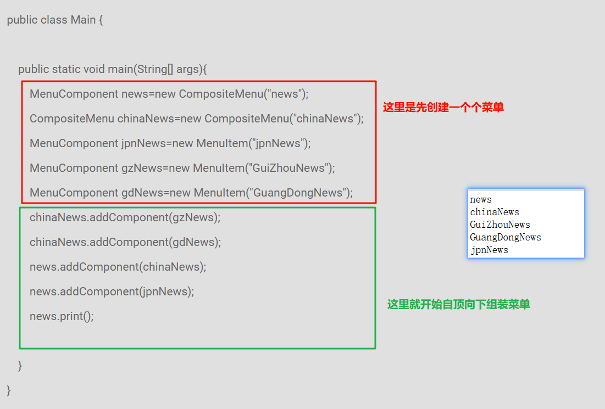

参考代码：

```java
class MenuItem extends MenuComponent{
    public MenuItem(String des){
        //菜单组件的描述des是放在父类中的，所以这里就利用构造方法初始化父类中的这个变量
        super(des);
    }
    @Override
    public void print() {
        //基本组件直接输出自己的描述信息就好，我们使用父类提供的getDec()方法来访问
        System.out.println(getDes());
    }
}
class CompositeMenu extends MenuComponent{

    //这个节点既然是其他组件拼起来的，自然就需要一个数组来记录其组成
    //这也是组合节点的核心要素
    private List<MenuComponent> list = new ArrayList<>();

    public CompositeMenu(String des){
        super(des);
    }

    @Override
    public void print() {
        //这里的逻辑要先看示例是怎么输出的。
        //是先打印组合节点的描述，然后依次打印其内部各节点的描述
        System.out.println(getDes());
        for(int i = 0;i < list.size();i++){
            list.get(i).print();
        }
    }

    @Override
    public void addComponent(MenuComponent c){
        //直接把组件存储到list中去
        list.add(c);
    }
}
```


### OJ例题二：

采用组合设计模式实现价格计算： Part类是零件（叶子节点）零件的价格直接由构造方法传入；

 Composite是组合件，由Componet组成，价格由子节点累计；

 Componet是零件和组件共有的父类，des数据域是名称；

请完成Composite类和Part类提交

```java
import java.util.*;


abstract class Component {
    String des="";
    public String getDes() {
        return des;
    }
    public void setDes(String des) {
        this.des = des;
    }
    
    public Component(String s) {
        this.des = s;
    }
    public abstract  double  computerPrice();
    public void addComponent(Component c){
        throw new UnsupportedOperationException("不能添加子节点");
    }
}

//请完成Composite类和Part类提交


public class Main {
    public static void main(String[] args){
        Composite computer=new Composite("计算机");
        Part mouse=new Part(30,"鼠标");
        Part keyBoard=new Part(40,"键盘");
        Part screen=new Part(800,"显示器");
        computer.addComponent(mouse);
        computer.addComponent(keyBoard);
        computer.addComponent(screen);
        Composite box=new Composite("机箱");
        Part mainBoard=new Part(800,"主板");
        Part displayCard=new Part(500,"显卡");
        Part disk=new Part(400,"硬盘");
        box.addComponent(mainBoard);
        box.addComponent(displayCard);
        box.addComponent(disk);
        computer.addComponent(box);
        System.out.println(box.computerPrice());
        System.out.println(computer.computerPrice());
    }
}
```


这个题非常具象化，电脑就是一个组合节点，因为它是由很多东西组装起来的嘛。

硬盘、显卡什么的都是电脑中的一部分。

这些基本部分有自己的价钱，而一台电脑的价钱就是内部这些部分价钱的总和。

```java
class Part extends Component{
    //最基本的组成成分有自己的价钱
    private double price;
    public Part(double price,String des){
        //这个构造方法为什么这么写是要看main方法里面的
        super(des);
        this.price = price;
    }

    @Override
    public double computerPrice() {
        //要计算基本组件的价钱，直接返回其价值就好了
        return price;
    }
}
class Composite extends Component{

    private List<Component> list = new ArrayList<>();

    public Composite(String des){
        super(des);
    }

    @Override
    public void addComponent(Component c) {
        list.add(c);
    }

    @Override
    public double computerPrice() {
        //电脑的价钱，等于其内部所有组件的价格之和
        //遍历求和
        double total = 0;
        for (int i = 0; i < list.size(); i++) {
            total += list.get(i).computerPrice();
        }
        return total;
    }
}
```


### 思考

OJ这两道例题采用的是哪个策略呢？（从牺牲安全性、牺牲透明性中选一个）


## 装饰器 1.2

装饰器的类图其实和组合的非常相似，这也是为什么我把这两个放一起的原因。

只不过装饰器模式中，和组合节点非常像的那一部分不再是一个数组，其只能装一个组件。


设个设计模式的核心角色就是：

- 组件
- 叶子节点
- 装饰器

这个和组合的差不多


我们看下面这幅图：


给手机套上不同功能的壳子后，手机就额外多了一些功能。

在这个例子中，手机是基本的叶子节点。而这些手机壳就是装饰器。我们把手机套进去之后，就可以实现拓展手机功能的效果。


只不过装饰器比较强的一点就是：装饰器可以套装饰器，即套了一个手机壳的手机，再套进一个手机壳里面，实现功能的叠加。这就是**套娃**！


我们最好结合题目来理解这个设计模式：


### OJ例题一：

Componet是界面组件中的抽象父类，其TextBox子类是文本框组件，Table子类是表格组件。

Decorator是抽象的装饰器父类，有两个具体的装饰器：ScrollDecorator给Componet画上滚动条

（简单地在被装饰对象draw()后System.out.print(" drawScroll")即可 ）

BorderDecorator给Componet画上边框

（简单地在被装饰对象draw()后System.out.print(" drawBorder");即可 ）

请完成ScrollDecorator 和 BorderDecorator 类并提交


```java
abstract class Component {
    abstract void draw();
}

class TextBox extends Component{
    @Override
    void draw() {
        System.out.print("drawTextBox");
    }
}

class Table extends Component{
    @Override
    void draw() {
        System.out.print("drawTable");
    }
}
abstract class Decorator extends Component{
    //装饰器的精髓，这个存的是被套壳的对象
    protected Component component;
}

/**
 完成ScrollDecorator  和 BorderDecorator 类并提交
 **/

public class Main{
    public static void main(String[] args){
        //这里是装饰器要实现的效果：层层套娃！应该从里往外看。
        Component table=new ScrollDecorator(new BorderDecorator(new Table()));
        Component text=new BorderDecorator(new TextBox());
        table.draw();
        System.out.println();
        text.draw();
    }
}
```


参考代码：

```java
class ScrollDecorator extends Decorator{

    public ScrollDecorator(Component component){
        this.component = component;
    }
    @Override
    void draw() {
        //结合题目示例输出我们知道，要先答应被装饰对象的信息后再打印自己的信息
        component.draw();
        System.out.print(" drawScroll");
    }
}
class BorderDecorator extends Decorator{
    public BorderDecorator(Component component){
        this.component = component;
    }

    @Override
    void draw() {
        component.draw();
        System.out.print(" drawBorder");
    }
}
```


### OJ例题二（我觉得期末不会这么考）

**Java IO 流的设计使用了装饰器设计模式**（如果本设计模式考小题的话，这句话是要考的喔，记下来就好），例如字符流输入流抽象类Reader 中有方法 public abstract int read() 读取一个字符 ； StringRead是具体的字符输入流，实现read()方法，从字符串中读取一个字符。FilterReader是抽象的装饰器类。请从FilterReader 类继承实现 LowerCaseStringReader ，把输入字符流中大写字母都转换为小写。

```java
import java.io.FilterReader;
import java.io.IOException;
import java.io.Reader;
import java.io.StringReader;

//只需要 补充完成 LowerCaseStringReader 类，且仅需提交 LowerCaseStringReader 类即可
class LowerCaseStringReader extends FilterReader {
    Reader in;
    protected LowerCaseStringReader(Reader in) {
        super(in);
        this.in=in;
    }
    @Override
    public  int read() throws IOException {
        /*

               请补充代码

         */
        
         /**
         * core:大写字母只需要加上32就能转换成对应的小写字母
         */

        int read = in.read();
        return read>='A'&&read<='Z'?read+32:read;
    }
}

public class Main{
    public static void main(String[] args) throws IOException {
        LowerCaseStringReader r=new LowerCaseStringReader(new StringReader("Design Pattern"));
        int c;
        while( (c=r.read())>0){
            System.out.print((char)c);
        }
    }
}

```

这一题只需要我们完成将大写转小写的功能。

这一题考了IO流的相关知识，我感觉有点超了。。。

我觉得期末不至于会这么考。

这题就作为了解吧，比如看看套娃，和题目的第一句话。


## 职责链

请求方只管提出请求，而无需知道请求是如何被处理的。

就好像我们日常的请假流程，**直接给导员说要请假，而请假的审批流程是不需要我们关心的。**这个设计模式就是在模拟这个行为。


### OJ例题

某公司申请经费，

1.金额小于1000的项目经理（ProjectManager）就可以审批:

```
System.out.println("ProjectManager pass");
```

2.小于2000的部门经理（DepartmentManager）可以审批:

```
System.out.println("DepartmentManager pass");
```

3.大于2000的只能总经理（TopManager）审批:

```
System.out.println("TopManager pass");
```

若经费大于10000，总经理直接拒绝

```
System.out.println("TopManager refuse");
```

使用职责链模式，申请人提交给项目经理申请经费，项目经理如果权限够的话就审批，不够的话就提交到上级领导，依次类推，直到能够处理请求为止。

请完成ProjectManager DepartmentManager TopManager 并提交该3个类。

```java
abstract class Manager {
    protected Manager superior;
    public abstract boolean handle(int fee);
    public void setSuccessor(Manager superior){
        this.superior=superior;
    }
}
//完成ProjectManager  DepartmentManager  TopManager 并提交该3个类
public class Main {
    public static void main(String[] args){
        int[] arr = {500, 1500, 2500, 29000};
        Manager pm = new ProjectManager();
        Manager dm = new DepartmentManager();
        Manager topm = new TopManager();
        pm.setSuccessor(dm);
        dm.setSuccessor(topm);

        for(int i = 0; i < arr.length; i++) {
            pm.handle(arr[i]);
        }
    }
}
```


要做出这个题，我们就必须梳理审批的流程。

这个题已经说得很清楚了。那我们就可以直接理出这样的一条“**链表**”。

项目经理→部门经理→总经理

请求就是沿着这样一条链层层递交的！

```java
class ProjectManager extends Manager{
    @Override
    public boolean handle(int fee) {
        if(fee < 1000){
            System.out.println("ProjectManager pass");
            return true;
        }else{
            //自己处理不了，那就交给下一个节点呗。下一个节点存储在superior中。
            return superior.handle(fee);
        }
    }
}

class DepartmentManager extends Manager{

    @Override
    public boolean handle(int fee) {
        if(fee < 2000){
            System.out.println("DepartmentManager pass");
            return true;
        }else{
            //同样的套路
            return superior.handle(fee);
        }
    }
}

class TopManager extends Manager{

    @Override
    public boolean handle(int fee) {
        //这是最后一个节点了，在这个节点中就不能再往上甩锅了，必须给出答复！
        if(fee < 10000){
            System.out.println("TopManager pass");
            return true;
        }else {
            System.out.println("TopManager refuse");
            return false;
        }
    }
}
```

仔细回顾一下这段代码，会发现套路还算是固定的。


## 观察者 1.4

意图：创建了对象间的一种**一对多的依赖关系**，**当一个对象状态改变时，所有依赖于它的对象都会得到通知并自动更新**。

换句话说，就是多的那方观察一的那一方。当一这一方有什么动静的时候就立马通知多的那一方。

5分钟学设计模式那个视频里讲的借贷的例子很形象，可以看这个视频举的例子后再来看这个。

这个例子的关键部分就是：是张三去主动告诉所有债主，自己可以还钱了，而不是债主亲自去询问张三。

张三要先记录下债主的联系方式才能给他们发通知馓，如何记录呢？用ArrayList！


先看这个设计模式的一些核心角色：

观察者：类似于例子中的债主，其内部约定好一个**update方法**。这个方法的作用是**接收张三传递过来的通知**。这个方法是**留给张三通知债主的时候调用的**。

主题：被观察的对象，类似于张三。其要对观察者提供以下方法：**订阅和取消订阅**。订阅就相当于记录债主的联系方式，取消订阅就是删除债主的联系方式呗。只有张三记录了的债主才会收到张三的通知。除此之外，其还要有一个**通知方法**。当张三有钱了就调用这个通知方法来提醒各位债主。


### OJ例题

如下代码 Subject 和 Observer 分别是观察者设计模式中的主题接口和观察者接口，

GameScore实现主题接口，记录篮球比赛的比分，其中gameTime数据域表示比赛进行的时间，

homeScore数据域表示主队得分，visitorScore数据域表示客队得分。

ScoreDB是其中一个观察者，将得分情况记录进入数据库

VoiceScore是其中一个观察者，语音播报得分

DisplayScore 是其中一个观察者，大屏显示得分

请将 GameScore 类补充完整并提交（只需提交GameScore 类）

```java
package 观察者;

import java.util.*;

interface Subject {
    public void registerObserver(Observer o);
    public void removeObserver(Observer o);
    public void notifyObserver();
}

interface Observer {
    public void update(String gameTime,int homeScore,int visitorScore);
}

/**补充完整GameScore 类并提交

 class GameScore implements Subject{

 private String gameTime;//比赛进行时间

 private int homeScore;//主队得分

 private int visitorScore;//客队得分


 public void setScore(String gameTime,int homeScore,int visitorScore){

 this.gameTime=gameTime;

 this.homeScore=homeScore;

 this.visitorScore=visitorScore;

 notifyObserver();

 }

 //....

 }

 **/

class ScoreDB implements  Observer{
    @Override
    public void update(String gameTime, int homeScore, int visitorScore) {
        System.out.println(String.format("%s:%d-%dwriteToDB",gameTime,homeScore,visitorScore));
    }
}

class VoiceScore implements  Observer{
    @Override
    public void update(String gameTime, int homeScore, int visitorScore) {
        System.out.println(String.format("%s:%d-%dvoice",gameTime,homeScore,visitorScore));
    }
}

class DisplayScore implements  Observer{
    @Override
    public void update(String gameTime, int homeScore, int visitorScore) {
        System.out.println(String.format("%s:%d-%dscreenDisplay",gameTime,homeScore,visitorScore));
    }
}

public class Main {

    public static void main(String[] args){
        GameScore gameScore=new GameScore();
        ScoreDB scoreDB=new ScoreDB();
        VoiceScore voiceScore=new VoiceScore();
        DisplayScore displayScore=new DisplayScore();

        gameScore.registerObserver(scoreDB);
        gameScore.registerObserver(voiceScore);
        gameScore.registerObserver(displayScore);

        gameScore.setScore("Game10minute",1,0);
        gameScore.removeObserver(voiceScore);
        gameScore.setScore("Game19minute",1,1);
    }
}
```

看代码之前，**先分析谁是观察者、谁是主题**。

这个题还好，我们只需补充主题那三个核心方法：

- 订阅
- 取消订阅
- 通知


参考代码：

```java
class GameScore implements Subject {

    private String gameTime;//比赛进行时间
    private int homeScore;//主队得分
    private int visitorScore;//客队得分

    //这一行是我们添加的，即观察者数组
    private List<Observer> list = new ArrayList<>();

    public void setScore(String gameTime, int homeScore, int visitorScore) {
        this.gameTime = gameTime;
        this.homeScore = homeScore;
        this.visitorScore = visitorScore;
        notifyObserver();
    }

    //下面三个方法是我们要写的
    @Override
    public void registerObserver(Observer o) {
        list.add(o);
    }

    @Override
    public void removeObserver(Observer o) {
        list.remove(o);
    }

    @Override
    public void notifyObserver() {
        //通知的时候就遍历观察者列表，然后调用每一个人的update方法即可
        for(int i = 0; i < list.size();i++){
            list.get(i).update(gameTime,homeScore,visitorScore);
        }
    }
}
```


## 代理 1.5

意图：为一个对象**提供一种代理**以**控制**对这个对象的访问。

举例：公司的董事长，以及董事长的秘书。他们二人就构成一种代理关系。具体体现在哪呢？

董事长是想见就见的么？当然不是！要见董事长必须先和秘书沟通。秘书觉得合适，才会把董事长叫过来。

在上述例子中，董事长就是意图中想表达的对象。**外界是不能直接访问到董事长的**，只能通过董事长的代理对象（也就是秘书）进行间接访问。


在这个设计模式中的核心角色主要有以下核心角色：

- 抽象主题
- 真实对象
- 代理


代理和真实对象都是抽象主题的实现类或者子类。


### OJ例题

现设计一个**投票管理器**，用来管理学生选举班长等活动，其接口 VoteManagerInterface 中 

 addStudent(Student s) 方法用来添加学生候选人 

 vote(Student voter,Student select) 用来提交学生voter投了学生select一票， 

 int getVoteNum(Student s) 方法用来获取某个学生的得票数， 

 VoteManager 类是一个实现， 

 **要求实现VoteManager的代理类，**

**控制对VoteManager的访问**（每个学生不能多次投其他某学生的票，且学生不能投自己）。


> 做这道题之前，先找一下代理的三大核心角色再哪里有所体现。
>
> 这题会比以往的有点难，因为要我们自己实现每个学生不能多次投其他某学生的票，且学生不能投自己这个需求！这个就要我们合理地利用数据结构了！


本题只要求我们完善代理类的设计。

我们先简单看一下VoteManager本身，其就只提供了基本的添加学生，投票，获取票数的实现。而且结合题意可以知道其并没有实现每个学生不能多次投其他某学生的票，且学生不能投自己这个需求！

所以这些限制应该加入到代理类中来。

在代理类中我们只需要知道这么一个核心：**在合适的时候才去调用真实对象！**

这个题目中好像只有投票这个方法有限制，那我们先看看题目中给定的这些投票情形哪些是无效的投票？理清楚这个有助于我们去实现：

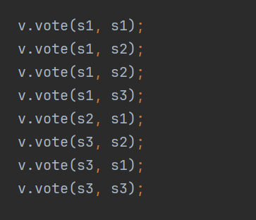


分析如下：

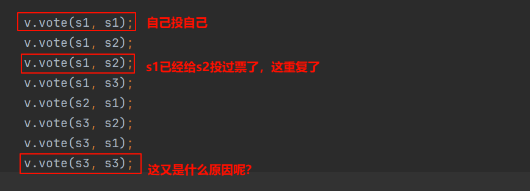

关键点一：

自己投自己怎么破？先看看非法情况是怎么传参的：传了同一个变量。

关键点二：

怎么保存投票的历史记录？只有保留了每一个人的投票记录我们才能知道某个人有没有重复投票哇。

为了实现这个功能，我自己想到的数据结构是这样的：

我需要每一个人和其投票对象的映射关系：

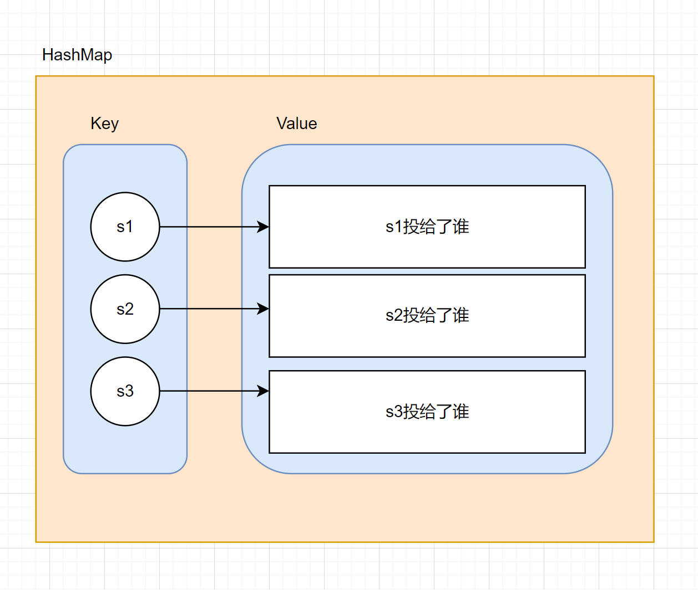


而**HashMap**是Java中用于表示映射关系最佳数据结构。


参考代码：

```java
class VoteManagerProxy implements VoteManagerInterface {

    //核心点1：需要一个变量来保存自己代理哪一个真实对象
    private VoteManagerInterface real;
    //提醒：这里这么干只是在使用多态。把VoteManagerInterface替换成VoteManager也没毛病。

    //投票历史对应的数据结构
    private Map<Student,List<Student>> votedHistory = new HashMap<>();

    public VoteManagerProxy(VoteManagerInterface real){
        this.real = real;
    }

    //核心点2：重新以下方法。代理和真实对象具有类似的行为，但是代理主要是进行一些条件判断，然后在合适的时候去调用真实对象的实现。
    @Override
    public void addStudent(Student s) {
        //添加学生这个方法题目中并没有提及什么限制，所以直接简单调用真实对象的相关方法就好了
        real.addStudent(s);
    }

    @Override
    public void vote(Student voter, Student select) {
        //这个是有限制的：每个学生不能多次投其他某学生的票，且学生不能投自己
        //关键点1的处理
        if(voter == select){
            //在void中使用return只是为了提前结束函数，因为非法情况就不应该继续执行下去了
            return;
        }
        //关键点2的处理，务必先去认识HashMap后再回来看喔！！！
        if(votedHistory.containsKey(voter)){
            //能进这里，说明此人投票过，接下来看看其有没有投过select
            List<Student> list = votedHistory.get(voter);
            if(list.contains(select)){
                //这哥们重复投票了
                return;
            }else{
                //这哥们目前还没投过select，那么就调用真实对象的相关方法
                real.vote(voter,select);
                //投完后记得登记
                list.add(select);
            }
        }else{
            //能进这里，说明此人还没投过票，我们要进行一些初始化
            //创建一条记录
            votedHistory.put(voter,new ArrayList<>());
            real.vote(voter,select);
            votedHistory.get(voter).add(select);
        }
    }

    @Override
    public int getVoteNum(Student s) {
        //没什么限制，直接调
        return real.getVoteNum(s);
    }
}
```


## 状态 1.7

意图：允许一个类的对象的**某些行为在其处于不同状态时，表现出不同的结果。**


这个设计模式的特点就是：**将那些和状态相绑定的方法抽取出去，使之成为一个状态接口（抽象），然后写不同状态下的实现。**


今天的题我是从实验报告里面抠出来的，然后稍稍改造了一下。我们重点关注上面我提到的特点具体体现在哪里。


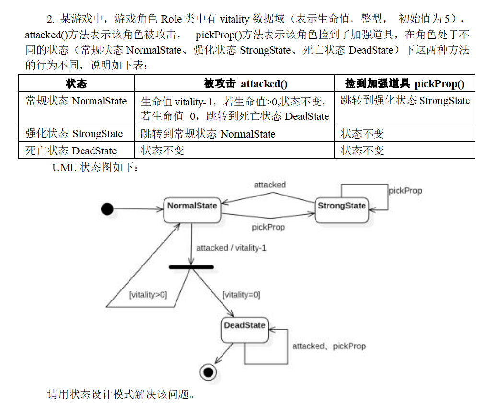

```java
class Role {
    private int vitality;
    private State state;

    public Role(State defaultState){
        state = defaultState;
        vitality = 5;
    }
    public void setState(State state){
        this.state = state;
    }
    public void setVitality(int vitality){
        this.vitality = vitality;
    }
    public int getVitality(){
        return vitality;
    }
    public void attacked(){
        state.attacked(this);
    }
    public void pickProp(){
        state.pickProp(this);
    }
}

abstract class State{
    //这里给个空实现，子类可以根据需要决定重写哪些方法
    public void attacked(Role context){}
    public void pickProp(Role context){}
}

/*
 *	请完成三个状态类的编写
 */

public class Main {
    public static void main(String[] args) {
        Role a1 = new Role(new NormalState());
        a1.attacked();
        a1.attacked();
        a1.attacked();
        a1.pickProp();
        a1.attacked();
        a1.attacked();
        a1.attacked();
        a1.attacked();
    }
}
```

执行结果：

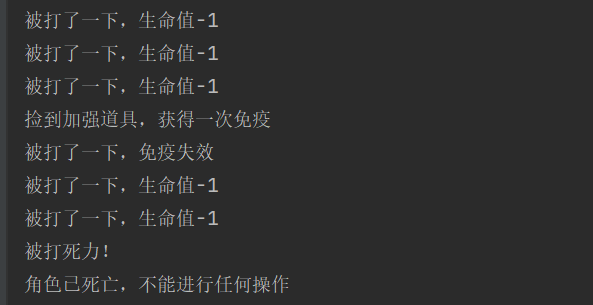

参考代码：

```java
class NormalState extends State{
    @Override
    public void attacked(Role context){
        //context被打了一下，生命值要减一
        //如果生命值减到0了，那么就要转到DeadState了
        int newVitality = context.getVitality() - 1;
        System.out.println("被打了一下，生命值-1");
        if(newVitality <= 0){
            System.out.println("被打死力！");
            context.setState(new DeadState());
        }
        context.setVitality(newVitality);
    }
    @Override
    public void pickProp(Role context) {
        System.out.println("捡到加强道具，获得一次免疫");
        context.setState(new StrongState());
    }
}
class StrongState extends State{
    @Override
    public void attacked(Role context) {
        System.out.println("被打了一下，免疫失效");
        context.setState(new NormalState());
    }
}
class DeadState extends State{
    @Override
    public void attacked(Role context) {
        System.out.println("角色已死亡，不能进行任何操作");
    }

    @Override
    public void pickProp(Role context) {
        System.out.println("角色已死亡，不能进行任何操作");
    }
}
```


# 非重点：记住意图也就差不多了，到时候看看往年卷子怎么考

## (1) 原型

一种船新的获取对象的方式。

**让被克隆的对象自己去负责克隆的过程。**

在Java中，其实每一个类都可以克隆，因为clone方法由顶层父类Object提供了。如果要调用这个方法是有前提的：支持克隆的类必须实现**Cloneable接口**。

这个接口是标记型接口（接口内部是空的）。

Object提供的clone方法默认是**浅克隆**：克隆出来的对象中所有成员变量的值都是从被克隆对象那里**直接复制**过去的，如果某个成员变量是引用类型的变量，那么二者将引用同一个对象（形象理解为**藕断丝连**）。


如何复习：只需要知道此设计模式的关键词是克隆就行。当题目中出现克隆二字时，能够迅速认识到这是原型设计模式就够了。


## (2) 外观

意图：


例子：

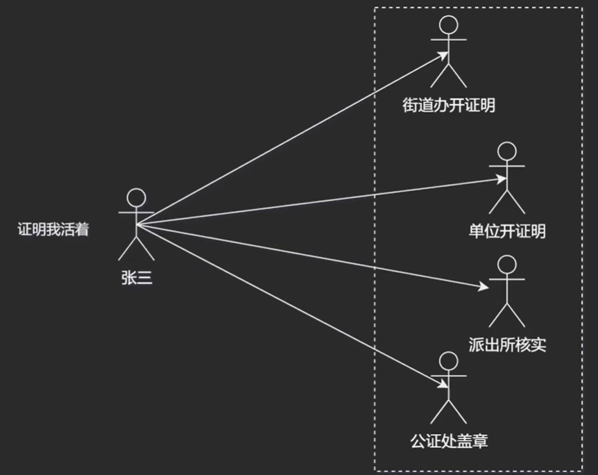

把右边虚线框当作一个子系统，张三比作用户。可以看到，用户必须了解全部细节才能用好这个子系统。很明显，这样做会让张三觉得这个子系统过于难用，因为于他而言这太复杂了。

外观模式干了一件什么事情呢？

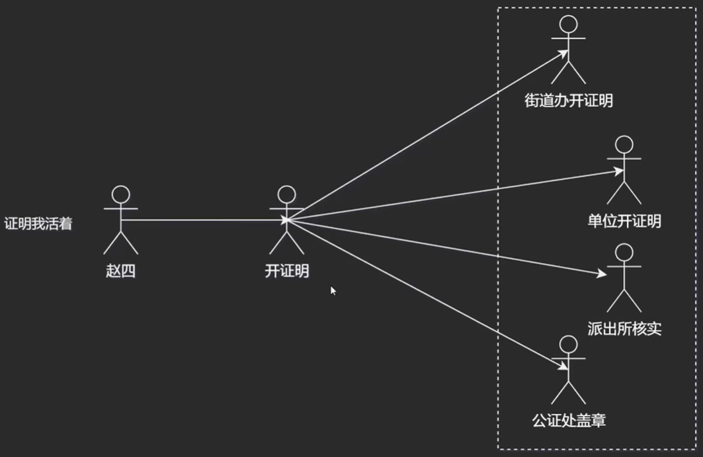

引入一个工作人员，张三只要找他开证明就好了。后续的流程张三就不用去管了。

这个工作人员就类似于子系统的高层次接口，其作用就在于**对外屏蔽系统的复杂性**，这样对于外界而言，这个系统就更加好用了。


关键：提供高层接口，使得子系统更加易用！


## (3) 工厂方法

抽象工厂中**只有一个创建产品**的抽象方法（借此回顾一下抽象工厂模式和本模式的区别）。

其子类来决定具体产品的创建。也就是说，工厂方法将创建产品延迟到了子类中进行。


以手机工厂为例：（手机和工厂都是抽象的，因为还没有具体到造哪个品牌的手机呢！）

小米手机工厂造小米手机、华为手机工厂造华为手机。（体会一下抽象和具体的感觉）


如果想增加一个vivo手机工厂，可以怎么做？

新建一个vivo手机工厂类，其实现手机工厂。然后其内部new vivo手机即可。


现在思考一下我们完成这个新需求是通过改动原有代码实现的还是添加新代码实现的？这体现了什么原则？————添加新代码，开闭原则。


## (4) 适配器

通过一个中间件（适配器）**将一个类的接口转换成客户期望的另一个接口**，**使原本不能一起工作的类能够协同工作。**

老师课上讲过的例子：**HashSet**的底层实现采用了此设计模式，其是将HashMap适配成了HashSet。


换一个生活化的例子来理解这个设计模式：给手机充电。

我们知道插座提供的电压是220V的，而手机的充电电压一般是5V。手机是用不了220V的。

这时，我们使用电源适配器来给手机充电。电源适配器将220V转变成了手机可接受的5V。

也就是说电源适配器是5V和220V之间的适配器。


## (5) 建造者

关键：将复杂对象的


## (6) 备忘录

捕获一个对象的内部状态，并**允许在对象之外保存和恢复这些状态**。

关键词：存档


## (7) 迭代器

关键：遍历数据结构


## (8) 桥接

关键：将抽象和实现解耦，使得二者可以独立变化。


## (9) 命令


官方定义不说人话。。。


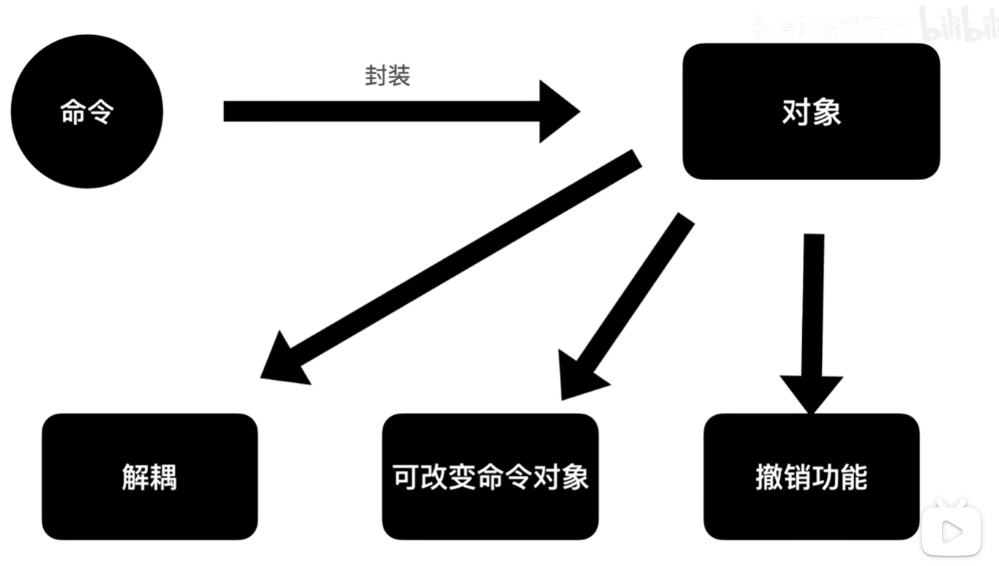


**将命令封装成对象**，从而实现解耦、可改变命令对象、撤销功能。


## (10) 中介者

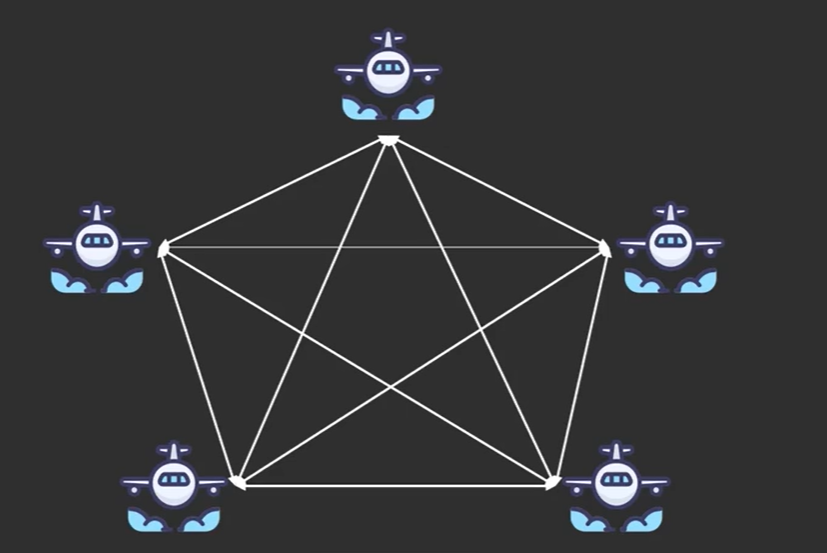

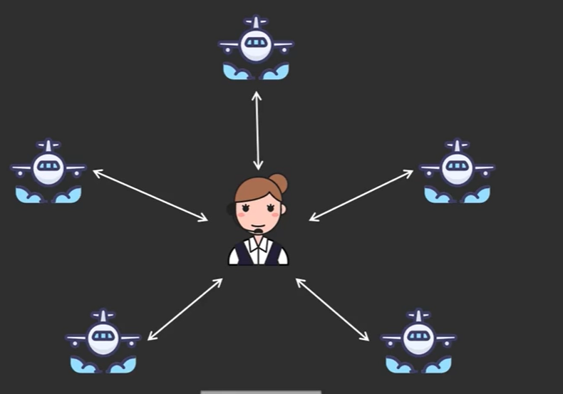

中间那个人作为所有飞机相互沟通的中介者。

这样，各个飞机之间就不用相互认识彼此（如果要认识对方，那么就要存一个引用变量来引用对方）

这体现了哪个原则？————迪特米原则


## (11) 享元

关键词：共享对象

常量池、线程池


## (12) 解释器

关键词：语法分析


特定语法规则

这个模式旨在指导我们如何开发一个语法解释器，它是一个**框架**，我们只要按照这个框架来，我们就可以开发自己的语法解释器


## (13) 访问者

关键词：双分派